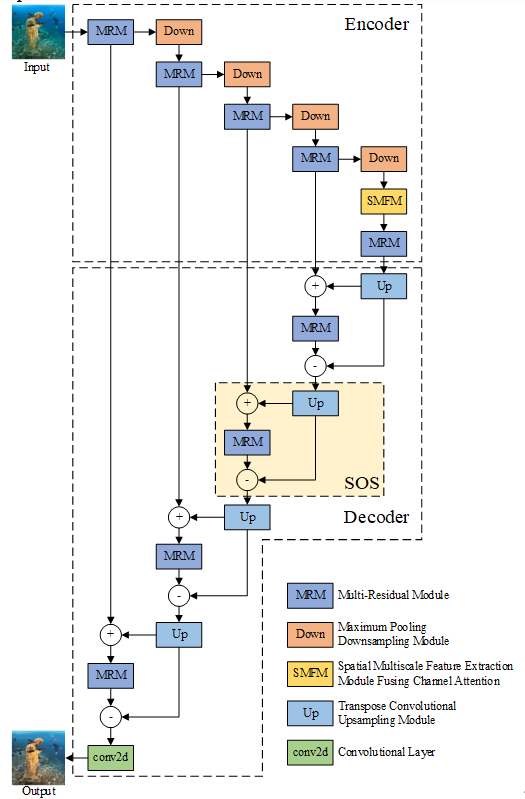

# Optimized UNet framework with a joint loss function for underwater image enhancement


#### [Xin Wang](https://github.com/WangXin81)


## Usage
Data preparation:

```
path|——dataset
         |——images
           |——train
             |——0001.jpg
             |——0002.jpg
             |——....
           |——val
             |——0001.jpg
             |——0002.jpg
             |——....
         |——labels
           |——train
             |——0001.jpg
             |——0002.jpg
             |——....
           |——val
             |——0001.jpg
             |——0002.jpg
             |——....
         
```


## Figs



## Datasets:

UIEB: 
[[An Underwater Image Enhancement Benchmark Dataset and Beyond (li-chongyi.github.io)](https://li-chongyi.github.io/proj_benchmark.html)]

UFO-120: 
[[The UFO-120 Dataset | Minnesota Interactive Robotics and Vision Laboratory (umn.edu)](https://irvlab.cs.umn.edu/resources/ufo-120-dataset)]


## Environments

1. Windows 
2. cuda 12.4+
3. pytorch 1.13+
4. python 3.9+

